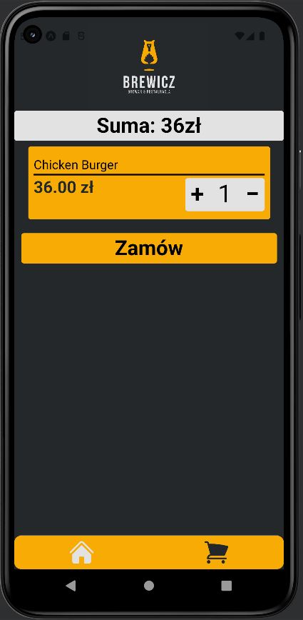

 ## Spis Treści
* [Informacje o projekcie](#informacje-o-projekcie)

* [Technologie](#technologie)

* [Jak uruchomić projekt?](#jak-uruchomić-projekt)

* [Ekrany](#ekrany)

## Informacje o projekcie

Aplikacja mobilna do zamawiania jedzenia z ulubionej lokalnej restauracji. Nawigacja poprzez taby.

## Technologie

* React Native
* Tailwindcss
* Redux

## Jak ruchomić projekt?

Aby uruchomić projekt na naszym komputerze lokalnym potrzebujemy:

* Android studio
* Terminal
* Node.js
* Java SDK

Następnie należy w terminalu uruchomić komendę:

```javascript 
npm install
```

```javascript 
npm start
```

aby uruchomić aplikację.

## Ekrany

1. Ekran główny


2. Lista produktów


3. Koszyk



